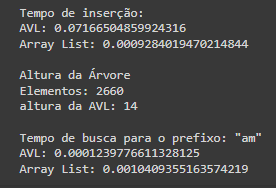
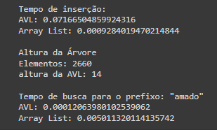
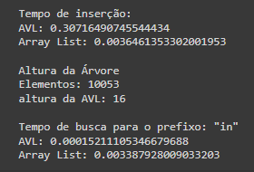
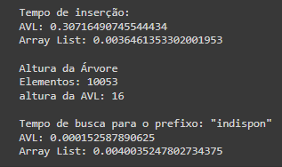

# Sistema de autocompletar palavras usando uma árvore AVL
Usando estrutura de dados em árvore com uma aplicação de Processamento de Linguagem Natural (PLN).

## Interface de pesquisa de prefixos
Feito através do import [Gradio](https://www.gradio.app/) no Google Colab.

## Análise comparativa entre desempenhos
Comparação de tempo de inserção, da análise entre arquivos corpus de tamanhos diferentes e tempo de busca com prefixos curtos e longos entre as duas estruturas de dados, AVL e lista. 

Para isso utilizamos os arquivos pdf's disponíveis em [BaixeLivros](https://www.baixelivros.com.br/dominio-publico).

### O pequeno Príncipe (4,6MB), em arquivo .txt possui 82KB:

| Prefixo menor | Prefixo maior |
|:-------------:|:-------------:|
|||

### Dom Casmurro (2MB), em arquivo .txt possui 431KB:

| Prefixo menor | Prefixo maior |
|:-------------:|:-------------:|
|||

## Vídeo Explicativo
Explicando o trabalho e apresentando o projeto pronto [aqui](https://youtu.be/FSSpx3Uo1TQ).
---

Feito com ❤ por <a href="https://github.com/quelita2" target="_blank">Quelita Míriam </a> e <a href="https://github.com/roseliasilva" target="_blank">Rosélia Nascimento </a> 👩🏼‍💻

