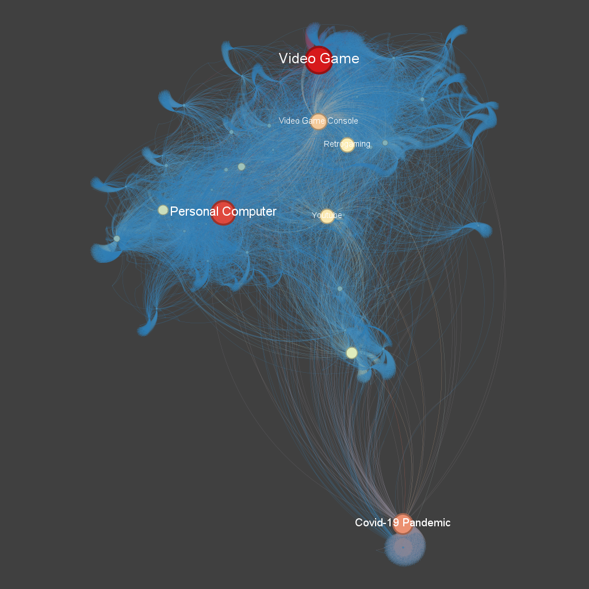

# Projeto Final - Redes Dirigidas no Wikipédia

## Descrição do Projeto
Este projeto faz parte da atividade final da Unidade 03, onde foi solicitado a construção de uma rede (grafo) dirigida a partir dos links das páginas do Wikipédia, utilizando como SEEDs os temas [Vintage Computer](https://en.wikipedia.org/wiki/Vintage_computer), [Retrogaming](https://en.wikipedia.org/wiki/Retrogaming) e [Retrocomputing](https://en.wikipedia.org/wiki/Retrocomputing). O objetivo é explorar as conexões entre as páginas relacionadas a esses temas e analisar a estrutura da rede.

## Requisitos Atendidos

### Requisito 01: Construção da Rede
A rede foi gerada a partir das três SEEDs mencionadas, limitando-se a um nível de profundidade 2. O código utilizado para gerar essa rede pode ser encontrado no arquivo `Wikipedia.ipynb`.

### Requisito 02: Visualização Básica no Gephi
Uma figura foi gerada utilizando o Gephi com um layout que destaca as diferentes comunidades na rede. As cores dos vértices representam as comunidades identificadas, e a visualização facilita a percepção dessas diferenças.
Foram geras as seguintes figuras:





### Requisito 03: Visualização com In-Degree
Outra figura foi gerada no Gephi, destacando o in-Degree dos vértices. Essa visualização mostra como certos nós da rede têm mais conexões direcionadas a eles, evidenciando sua importância na estrutura da rede.

### Requisito 04: Análise de k-core e k-shell
Uma análise foi feita utilizando o k-core e k-shell da rede. O layout dessa visualização foi livremente escolhido para destacar as diferentes camadas dentro da rede. Os vértices foram redimensionados de acordo com a métrica de in-degree.

### Requisito 05: Rede Final com Comunidades e In-Degree
A rede final foi produzida de forma análoga ao explicado durante o curso, com as cores dos vértices relacionadas às comunidades e o tamanho dos vértices proporcional ao in-degree. Essa visualização final oferece uma visão completa da estrutura e dinâmica da rede.

## Detalhes para Reprodução do Código

### Requisitos
- Python 3.x
- Bibliotecas:
  - NetworkX
  - Matplotlib
  - Seaborn
  - Pandas
- Software Gephi (para visualização das redes)

### Passos para Reproduzir
1. Clone o repositório:
   ```bash
   git clone [seu-link-github]
   cd [nome-do-repositório]
   ```
2. Instale as dependências:
   ```bash
   pip install -r requirements.txt
   ```
3. Execute os notebook principal (`code.ipynb`) para gerar a rede e os arquivos necessários para a visualização no Gephi.

## Vídeo de Apresentação
Para uma explicação detalhada dos resultados e como o projeto foi desenvolvido, assista ao vídeo de apresentação [aqui](https://loom.com/your-video-link).

## Autor(a)
Rosélia Nascimento da Silva
